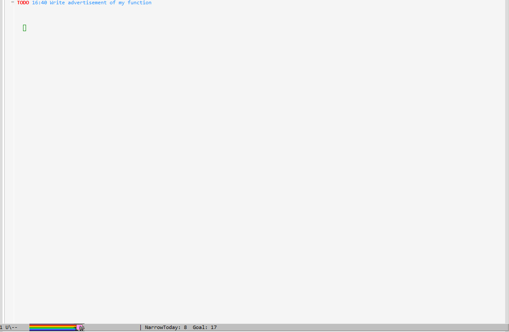

# Installation

Clone or download this repository (path of the folder is the <roam-with-helm> used below).

In your ~/.emacs, add the following two lines:

    (add-to-list 'load-path "<roam-with-helm>")
    (require 'roam-with-helm)

# Usage

By press: \`M-x roam-with-helm-org-roam-find-file\`

    (define-key org-mode-map (kbd "C-c f") 'roam-with-helm-org-roam-find-file)
    
Or for version-2
    
    (define-key global-mode-map (kbd "C-c f") 'helm-org-roam)

## Jump to the content

After input the title, press `RET` to visit the file

## Preview the content

In helm, press `C-c C-f`. When navigation, you can preview the
content.

## Insert the contents as a transclusion link.

This requires user to mark the candidates by pressing `C-SPC`. After
the selection, press `RET` to insert the candidates as
transclusions.

# Issue

It cannot insert a normal link as `org-roam-insert-immediate` on the
fly depending on existence of notes.

So, this function is tweaked as a separated function. You can use
your favorite completing system as you used to.
